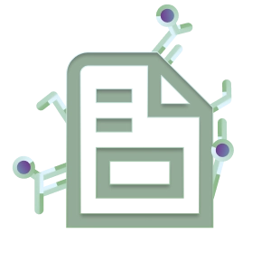

<a name="top"></a>

<!-- header -->
[![Contributors][contributors-shield]][contributors-url]
[![Forks][forks-shield]][forks-url]
[![Stargazers][stars-shield]][stars-url]
[![Issues][issues-shield]][issues-url]
[![Unlicense License][license-shield]][license-url]
[![LinkedIn][linkedin-shield]][linkedin-url]
<br />

<div align="center">
  <a href="https://github.com/johannesbausch/kickstarter-repository">
    
  </a>

  <h1 align="center">README.md Template</h1>

  <p align="center">
    A cheat code for the lazy folks out there.
    <br />
    This repository is a structural template, which can be forked and used!
    <br />
    <br />
    Please ⭐ this repository if you find it helpful!
    <br />
    <br />
    <a href="https://github.com/johannesbausch/kickstarter-repository/issues/new?labels=enhancement&template=feature_request.md">Request a Feature</a>
    |
    <a href="https://github.com/johannesbausch/kickstarter-repository/issues/new?labels=bug&template=bug_report.md">Report a Bug</a>
  </p>
</div>
<br />


<details>
<summary>Agenda</summary>
  
  - [1. Project Information](#1-project-information)
    - [1.1. Languages](#1-1-languages)
    - [1.2. Tools](#1-2-tools)
  - [2. Getting Started](#2-getting-started)
    - [2.1. Requirements](#2-1-requirements)
    - [2.2. Installation](#2-2-installation)
  - [3. Example](#3-example)
  - [4. Step by Step Guide](#4-step-by-step-guide)
  - [5. How To Contribute](#5-how-to-contribute)
    - [5.1. Contributors](#5-1-contributors)
  - [6. TODO](#6-todo)
  - [7. Contact Me](#7-contact-me)
  - [8. License](#8-license)
  - [9. Credits](#9-credits)

</details>


# 1. Project Information

While there are a lot of well documented open source projects out there, I think it is important to keep it simple and straight forward.
Because next to the experienced senior developer, there is always a junior that struggles with (mostly spared out) fundamentals.
<br />
This `README.md` template embraces this ethos because:

* It is very detailed and clear.
  <br />
  <br />
* It follows a consistent approach.
  <br />
  <br />
* It emphasizes the "Explain Like I'm Five" philosophy.

This template contains placeholders and can be customized as needed!
<br />
Fork this project to get started.

<div align="right">
  
  [Jump to Top](#top)

</div>
<br />


## 1.1. Languages

Languages used:

* [![Typescript][developer.mozilla.org]][Typescript-url]
* [![Markdown][Markdownguide.org]][Markdown-url]

<div align="right">
  
  [Jump to Top](#top)
  
</div>
<br />


## 1.2. Tools

Tools used:
<br />
_No specific tools were involved in this process._

<div align="right">
  
  [Jump to Top](#top)

</div>
<br />


# 2. Getting Started

In this section, you will learn how to integrate this project into your own.


## 2.1. Requirements

Before proceeding, ensure you have a package manager installed, such as npm.

* npm
  ```shell
  npm install npm@latest -g
  ```
<br />

<div align="right">
  
  [Jump to Top](#top)
  
</div>
<br />


## 2.2. Installation

Follow the instructions below and run the commands in a shell of your choice.

1. **Get a free API Key at [https://example.com](https://example.com)**
   <br />
   <br />
2. **Clone the repository:**
   ```shell
   git clone https://github.com/your_username/your_repository.git
   ```
   <br />
3. **Install the NPM packages:**
   ```shell
   npm install
   ```
   <br />
4. **Implement the API key in your `config.js`:**
   ```typescript
   const API_KEY = 'ENTER YOUR API';
   ```
   <br />
5. **Change the Git remote URL to avoid pushing to the base project by mistake:**
   ```shell
   git remote set-url origin your_username/your_repository
   ```
   <br />
6. **Confirm the changes:**
   ```shell
   git remote -v
   ```

<div align="right">
  
  [Jump to Top](#top)

</div>
<br />


# 3. Example

This section provides examples of how your project can be used.

```typescript
// Your function to calculate the factorial of a number
function factorial(n: number): number | string {
    // Check if the number is negative
    if (n < 0) {
        return "Factorial is not defined for negative numbers.";
    }

    // Factorial of 0 or 1 is 1
    if (n === 0 || n === 1) {
        return 1;
    }

    let result = 1;

    // Loop through all numbers from 2 to n and multiply them
    for (let i = 2; i <= n; i++) {
        result *= i;
    }

    return result;
}
```

```typescript
// Example usage
const number: number = 5;
console.log(`The factorial of ${number} is ${factorial(number)}.`);
```

<div align="right">
  
  [Jump to Top](#top)

</div>
<br />


# 4. Step by Step Guide

Here, you can guide the user through a step-by-step manual. 
For example, if this documentation is for installing Linux (Debian Distribution) as WSL2, it could look like this:

1. **Open PowerShell (as Administrator)**
   <br />
   <br />
2. **Install WSL2:**
   ```shell
   wsl --install -d Debian
   ```
   <br />
3. **Start the Subsystem:**
   ```shell
   wsl
   ```
   <br />
4. **(...):**
   ```shell
   (...)
   ```

<div align="right">
  
  [Jump to Top](#top)

</div>
<br />


# 5. How To Contribute

Contributions are what make the open-source community such an amazing place to learn, inspire, and create. Any contributions you make are greatly appreciated.
If you have a suggestion for improvement, please fork this repository and create a pull request. 
Alternatively, you can open an issue with the "enhancement" tag.

[Guide](https://github.com/johannesbausch/kickstarter-repository/blob/main/docs/HOW_TO_CONTRIBUTE.md)

<div align="right">
  
  [Jump to Top](#top)
  
</div>
<br />


## 5.1. Contributors:

<a href="https://github.com/johannesbausch/kickstarter-repository/graphs/contributors">
  
</a>

<div align="right">
  
  [Jump to Top](#top)

</div>
<br />


# 6. TODO

This template repository includes many of the essential features, but it's important to customize it for your project, as every tech stack has its own requirements. Consider adding the following enhancements to tailor the repository to your needs.

[TODO](https://github.com/johannesbausch/kickstarter-repository/blob/main/TODO.md)

<div align="right">
  
  [Jump to Top](#top)

</div>
<br />


# 7. Contact Me

Your Name - [@some_platform](https://example.com/your_username) - email@example.com

Project Link: [https://github.com/your_username/your_repository](https://github.com/your_username/your_repository)

<div align="right">
  
  [Jump to Top](#top)

</div>
<br />


# 8. License

This project is licensed under the Unlicense License. See [License](https://github.com/johannesbausch/kickstarter-repository/blob/main/LICENSE) for more details.

<div align="right">
  
  [Jump to Top](#top)

</div>
<br />


# 9. Credits

Credit where credit's due.

* [Choose an Open Source License](https://choosealicense.com)
* [Img Shields](https://shields.io)
* [Flaticons](https://flaticon.com)
* [Figma](https://figma.com)
* [Squoosh](https://squoosh.app)

<div align="right">
  
  [Jump to Top](#top)

</div>
<br />

<!-- markdown reference-style-links (shields) -->
[contributors-shield]: https://img.shields.io/github/contributors/johannesbausch/kickstarter-repository.svg?style=for-the-badge
[contributors-url]: https://github.com/johannesbausch/kickstarter-repository/graphs/contributors
[forks-shield]: https://img.shields.io/github/forks/johannesbausch/kickstarter-repository.svg?style=for-the-badge
[forks-url]: https://github.com/johannesbausch/kickstarter-repository/network/members
[stars-shield]: https://img.shields.io/github/stars/johannesbausch/kickstarter-repository.svg?style=for-the-badge
[stars-url]: https://github.com/johannesbausch/kickstarter-repository/stargazers
[issues-shield]: https://img.shields.io/github/issues/johannesbausch/kickstarter-repository.svg?style=for-the-badge
[issues-url]: https://github.com/johannesbausch/kickstarter-repository/issues
[license-shield]: https://img.shields.io/github/license/johannesbausch/kickstarter-repository.svg?style=for-the-badge
[license-url]: https://github.com/johannesbausch/kickstarter-repository/blob/master/LICENSE.txt
[project-image]: images/project-image.png
[linkedin-shield]: https://img.shields.io/badge/-LinkedIn-black.svg?style=for-the-badge&logo=linkedin&colorB=555
[linkedin-url]: https://linkedin.com/in/johannesbausch

<!-- markdown reference-style-links (tech) -->
[Developer.mozilla.org]: https://img.shields.io/badge/typescript-3178C6?style=for-the-badge&logo=typescript&logoColor=white
[TypeScript-url]: https://www.typescriptlang.org/
[Markdownguide.org]: https://img.shields.io/badge/markdown-000000?style=for-the-badge&logo=markdown&logoColor=white
[Markdown-url]: https://www.markdownguide.org/
[Svelte.dev]: https://img.shields.io/badge/Svelte-4A4A55?style=for-the-badge&logo=svelte&logoColor=FF3E00
[Svelte-url]: https://svelte.dev/
